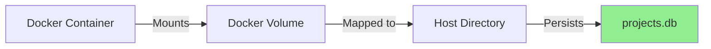

# 🐳 Docker Database Architecture - AI Avatar Studio

## 📋 Overview

This document explains the **Docker-based database architecture** for AI Avatar Studio. The application uses **SQLite** as the database engine with **Docker volumes** for persistent data storage.

---

## 🏗️ Architecture Decision

### Why SQLite in Docker?

**SQLite** is chosen because:
- ✅ **Zero configuration** - No separate database server needed
- ✅ **Lightweight** - Perfect for desktop applications
- ✅ **ACID compliant** - Reliable transactions
- ✅ **File-based** - Easy backups and portability
- ✅ **No network overhead** - Fast local access
- ✅ **No licensing costs** - Public domain

### Database Location

```
INSIDE DOCKER CONTAINER:
/app/data/database/projects.db

MAPPED TO HOST (Docker Volume):
./docker_volumes/data/database/projects.db
```

**Key Point**: The database file lives in a **Docker volume** that persists even when containers are stopped or removed.

---

## 📂 Docker Volume Structure

```
docker_volumes/
├── data/                           # Application data (persistent)
│   ├── database/
│   │   └── projects.db            # ← MAIN DATABASE FILE
│   ├── cache/                     # Temporary processing files
│   └── logs/                      # Application logs
│
├── models/                         # AI models (persistent, ~3-5GB)
│   ├── tts/
│   ├── wav2lip/
│   └── face_detection/
│
└── output/                         # Generated videos (persistent)
    ├── videos/
    └── thumbnails/
```

### Volume Mapping in docker-compose.yml

```yaml
volumes:
  # Database and logs - CRITICAL DATA
  - avatar_data:/app/data
  
  # AI models - LARGE FILES, downloaded once
  - avatar_models:/app/models
  
  # Generated outputs - CAN GROW LARGE
  - avatar_output:/app/output
  
  # Local access to outputs
  - ./local_output:/app/output/videos
```

---

## 🔧 Database Configuration

### Environment Variables

```bash
# In docker-compose.yml
environment:
  - DATABASE_PATH=/app/data/database/projects.db
  - MODELS_PATH=/app/models
  - OUTPUT_PATH=/app/output
  - CACHE_PATH=/app/data/cache
```

### Connection String

```python
# In Python code
import os
from utils.database import DatabaseManager

# Automatically uses DATABASE_PATH environment variable
db = DatabaseManager()

# Or specify custom path
db = DatabaseManager('/app/data/database/projects.db')
```

---

## 🚀 Setup & Usage

### 1. Initial Setup (Windows)

```cmd
# Run setup script
cd "C:\Users\rkste\Desktop\AI  Avatar  talking"
scripts\docker_manage.bat setup
```

This will:
1. Create volume directories
2. Build Docker image
3. Start containers
4. Initialize database automatically

### 2. Initial Setup (Linux/Mac)

```bash
# Make script executable
chmod +x scripts/docker_manage.sh

# Run setup
./scripts/docker_manage.sh setup
```

### 3. Verify Database

```cmd
# Check status
scripts\docker_manage.bat status
```

Output:
```
Database Status:
✓ Database exists (Size: 2.5 MB)
Total Projects: 5
Total Generations: 12
Success Rate: 91.67%
```

---

## 💾 Data Persistence

### How Data Survives Container Restarts



**Key Benefits:**
- ✅ Stop container → Data remains
- ✅ Remove container → Data remains
- ✅ Rebuild image → Data remains
- ✅ Update code → Data remains

**Only destroyed if:**
- ❌ Manually delete `docker_volumes/` folder
- ❌ Run `docker_manage.bat reset` (with confirmation)

---

## 🔄 Database Operations

### Backup Database

```cmd
# Windows
scripts\docker_manage.bat backup

# Creates: backups/projects_backup_20231222_143052.db
```

```bash
# Linux/Mac
./scripts/docker_manage.sh backup
```

### Restore Database

```cmd
# Windows
scripts\docker_manage.bat restore backups\projects_backup_20231222_143052.db
```

```bash
# Linux/Mac
./scripts/docker_manage.sh restore backups/projects_backup_20231222_143052.db
```

### Manual Backup (Direct Copy)

```cmd
# Stop containers
docker-compose down

# Copy database file
copy docker_volumes\data\database\projects.db backups\manual_backup.db

# Restart containers
docker-compose up -d
```

---

## 📊 Database Schema

### Tables Overview

```
projects              → User projects
├── generations       → Avatar generation records
│   ├── settings      → Generation-specific settings
│   └── processing_logs → Detailed processing logs
├── model_versions    → Installed AI models
├── user_preferences  → User settings
└── batch_queue       → Batch processing queue
```

### Key Relationships

```sql
projects (1) ──→ (N) generations
generations (1) ──→ (1) settings
generations (1) ──→ (N) processing_logs
```

---

## 🔍 Accessing the Database

### From Host Machine

```cmd
# Install SQLite (if not already installed)
# Windows: Download from https://www.sqlite.org/download.html

# Open database
sqlite3 docker_volumes\data\database\projects.db

# Run queries
sqlite> SELECT * FROM projects;
sqlite> .tables
sqlite> .schema projects
```

### From Docker Container

```cmd
# Enter container shell
scripts\docker_manage.bat shell

# Inside container
python3
>>> from utils.database import DatabaseManager
>>> db = DatabaseManager()
>>> stats = db.get_statistics()
>>> print(stats)
```

### Using Python Script

```python
# test_database.py
from utils.database import DatabaseManager

db = DatabaseManager()

# Get all projects
projects = db.get_all_projects()
for project in projects:
    print(f"Project: {project['name']} - Status: {project['status']}")

# Get statistics
stats = db.get_statistics()
print(f"Total Generations: {stats['total_generations']}")
print(f"Success Rate: {stats['success_rate']:.2f}%")
```

---

## 🛡️ Data Integrity & Safety

### Automatic Integrity Checks

The database manager includes automatic integrity checks:

```python
# In utils/database.py
def check_integrity(self) -> bool:
    """Check database integrity"""
    with self.get_connection() as conn:
        cursor = conn.cursor()
        result = cursor.execute("PRAGMA integrity_check;").fetchone()
        return result[0] == 'ok'
```

### Transaction Safety

All operations use transactions:

```python
@contextmanager
def get_connection(self):
    conn = sqlite3.connect(self.db_path)
    try:
        yield conn
        conn.commit()  # Auto-commit on success
    except Exception as e:
        conn.rollback()  # Auto-rollback on error
        raise
    finally:
        conn.close()
```

### Foreign Key Constraints

```sql
-- Cascade deletes to maintain referential integrity
FOREIGN KEY (project_id) REFERENCES projects(id) ON DELETE CASCADE
```

---

## 📈 Performance Optimization

### Indexes

```sql
-- Performance indexes created automatically
CREATE INDEX idx_generations_project_id ON generations(project_id);
CREATE INDEX idx_generations_status ON generations(status);
CREATE INDEX idx_generations_created_at ON generations(created_at DESC);
CREATE INDEX idx_batch_queue_status ON batch_queue(status);
```

### Connection Pooling

```python
# Enable WAL mode for better concurrency
conn.execute("PRAGMA journal_mode=WAL;")
conn.execute("PRAGMA synchronous=NORMAL;")
conn.execute("PRAGMA cache_size=-64000;")  # 64MB cache
```

---

## 🧹 Maintenance

### Cleanup Old Data

```cmd
# Windows
scripts\docker_manage.bat cleanup
```

This will:
- Delete cache files older than 7 days
- Delete logs older than 30 days
- Run Docker system cleanup
- Vacuum database (optional)

### Database Vacuum

```python
# Reclaim space from deleted records
from utils.database import DatabaseManager

db = DatabaseManager()
with db.get_connection() as conn:
    conn.execute("VACUUM;")
print("Database vacuumed successfully")
```

---

## 🚨 Troubleshooting

### Database Locked Error

**Symptom**: `sqlite3.OperationalError: database is locked`

**Solution**:
```python
# Increase timeout in database.py
conn = sqlite3.connect(
    self.db_path,
    timeout=30.0  # Wait up to 30 seconds
)
```

### Corrupted Database

**Recovery Steps**:

1. Stop containers:
```cmd
docker-compose down
```

2. Check integrity:
```cmd
sqlite3 docker_volumes\data\database\projects.db "PRAGMA integrity_check;"
```

3. If corrupted, restore from backup:
```cmd
copy backups\projects_backup_LATEST.db docker_volumes\data\database\projects.db
```

4. Restart containers:
```cmd
docker-compose up -d
```

### Missing Database

If database file is missing:

```cmd
# Initialize new database
docker-compose exec ai-avatar-studio python3 -c "from utils.database import DatabaseManager; DatabaseManager()"
```

---

## 📊 Monitoring

### Database Size

```cmd
# Windows
dir docker_volumes\data\database\projects.db

# Linux/Mac
ls -lh docker_volumes/data/database/projects.db
```

### Statistics Dashboard

```python
# get_stats.py
from utils.database import DatabaseManager

db = DatabaseManager()
stats = db.get_statistics()

print(f"""
╔══════════════════════════════════════╗
║   AI AVATAR STUDIO - DATABASE STATS  ║
╠══════════════════════════════════════╣
║ Total Projects:       {stats['total_projects']:>15} ║
║ Total Generations:    {stats['total_generations']:>15} ║
║ Completed:            {stats['completed_generations']:>15} ║
║ Failed:               {stats['failed_generations']:>15} ║
║ Success Rate:         {stats['success_rate']:>14.2f}% ║
║ Avg Processing Time:  {stats['average_processing_time_seconds']:>11.2f}s ║
╚══════════════════════════════════════╝
""")
```

---

## 🔐 Security Considerations

### File Permissions

```bash
# Linux/Mac: Set proper permissions
chmod 755 docker_volumes/data/database
chmod 644 docker_volumes/data/database/projects.db
```

### Access Control

- Database is **NOT exposed** to network
- Only accessible from:
  - Inside Docker container
  - Host machine via volume mount
  - No external access

### Sensitive Data

Currently, no sensitive data is stored. If you add user authentication:

```python
# Use proper encryption for passwords
import hashlib

def hash_password(password: str) -> str:
    return hashlib.sha256(password.encode()).hexdigest()
```

---

## 📝 Summary

### ✅ What You Get

1. **Persistent Database**: Survives container restarts
2. **Easy Backups**: One-command backup/restore
3. **No Configuration**: Works out of the box
4. **Performance**: Optimized with indexes
5. **Data Integrity**: ACID compliance + foreign keys
6. **Monitoring**: Built-in statistics and logs

### 📦 File Locations

| Item | Location (Container) | Location (Host) |
|------|---------------------|-----------------|
| Database | `/app/data/database/projects.db` | `./docker_volumes/data/database/projects.db` |
| Logs | `/app/data/logs/` | `./docker_volumes/data/logs/` |
| Cache | `/app/data/cache/` | `./docker_volumes/data/cache/` |
| Models | `/app/models/` | `./docker_volumes/models/` |
| Outputs | `/app/output/` | `./docker_volumes/output/` |

### 🎯 Quick Commands

```cmd
# Setup
scripts\docker_manage.bat setup

# Start
scripts\docker_manage.bat start

# Check status
scripts\docker_manage.bat status

# Backup
scripts\docker_manage.bat backup

# View logs
scripts\docker_manage.bat logs

# Stop
scripts\docker_manage.bat stop
```

---

## 🤝 Need Help?

Check the troubleshooting section or review:
- [docker-compose.yml](../docker-compose.yml)
- [utils/database.py](../utils/database.py)
- [Dockerfile](../Dockerfile)

---

**Last Updated**: December 22, 2025  
**Version**: 1.0.0
